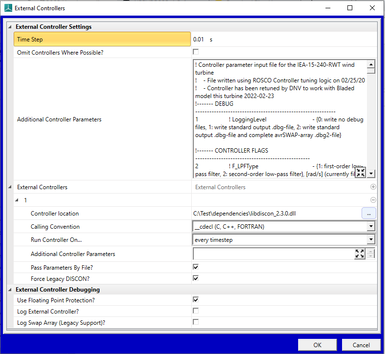

.. toctree::

.. _ROSCO_instructions_for_Bladed:

Running Bladed simulations with ROSCO controller
================================================

ROSCO controller can be used with Bladed.

ROSCO dll must be built to 32bit windows version. Most pre-built
discon.dlls in ROSCO github are 64bit, so you may need to build from
source.

 

Configuration in Bladed is as follows:

 

Bladed versions 4.6 to current (4.12)
-------------------------------------

In the Bladed External Controller dialog, fill in the fields as follows:

-  *'Time step'*  value non-critical as ROSCO adapts to whatever value
   is specified. Suggest 10ms.

   

-  *'Additional Controller Parameters'* - copy all text from DISCON.IN
   for the relevant turbine and paste in to this field.

   Notes:

   -  This must be the topmost field called 'Additional Controller Parameters', not the field with the same name lower down in external controller 1 settings.

   -  Do not add, remove or re-order any lines in this text as this will break ROSCO parsing of the content.

   -  Any paths such as PerfFileName must be absolute (eg 'C:\ROSCO\config.txt', not '..\config.txt') for use with Bladed.

-  Add an external controller (click “+”) and set

   -  *'Controller location'* - path to the ROSCO libdiscon_win32.dll

   -  *'Calling convention'* - \__cdecl

   -  *'Additional Controller Parameters'* - blank

   -  *'Pass parameters by file'* - must be ticked (this instructs Bladed to create a DISCON.IN file at runtime with the text from the Additional Controller Parameters window, and ROSCO reads from this file)

   -  *'Force legacy discon'* - ticked

**Example setup shown in the image below**\ |image1|

Bladed 4.5 & earlier
--------------------

In External Controller dialog,

-  *'Communication interval'* - ROSCO adapts to whatever value is specified. Suggest 10ms.

-  *'Controller code'* - path to the ROSCO libdiscon_win32.dll

-  *'Calling convention'* - \__cdecl

-  *'External Controller data'* - copy the configuration text from DISCON.IN for the relevant turbine and paste in to this field.

   Notes:

   -  Do not add, remove or re-order any lines in this text as this will break ROSCO parsing of the content

   -  Any paths such as PerfFileName must be absolute (eg 'C:\ROSCO\config.txt', not '..\config.txt') for use with Bladed.

**Troubleshooting (all Bladed versions)**

Most error messages from ROSCO are not passed to the Bladed GUI for
display or logging. They will be visible only in the transient DOS
window that appears while a Bladed simulation is running. If there is a
problem you will likely see only 'simulation terminated unexpectedly' in
Bladed UI. To view error messages from ROSCO you will need to run Bladed
from the command line. This will ensure that the console window where
errors are displayed remains open to view the error message.

Instructions to run Bladed from the command line are available
`here <https://renewableenergysoftwareportal.dnv.com/KnowledgeBase/Details?productID=1&knowledgeBaseID=30&category=Calculation%20Setup&SearchRawUrl=%2FKnowledgeBase%2FSearch%3FproductID%3D1%26category%3DCalculation%2520Setup>`__
on the Bladed Knowledge Base

